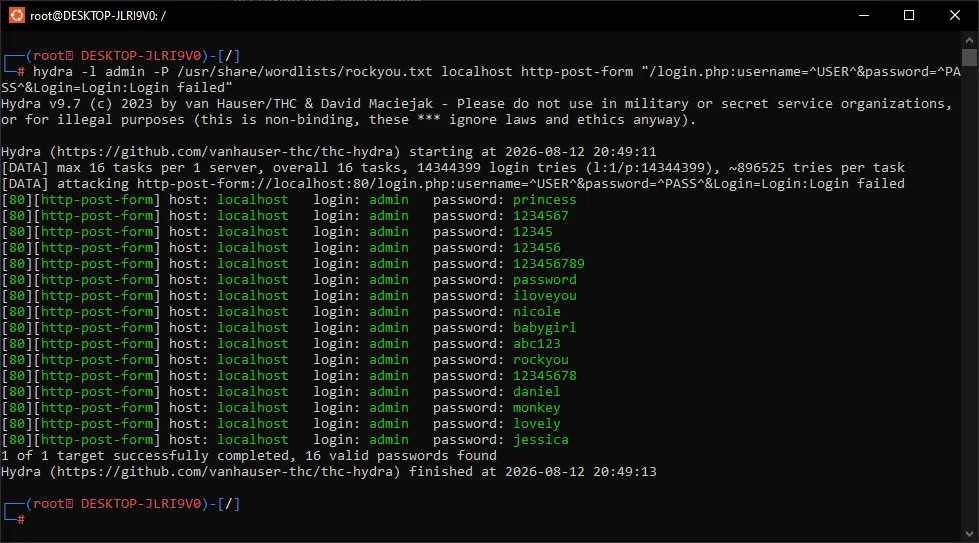

# Brute-Force Attack — Hydra vs DVWA Login (Low Security)

## Target
DVWA's login form (`/login.php`), running locally via Docker, security level set to **Low**. Attacked using Hydra from a Kali Linux container.

## Objective
Attempt a dictionary-based brute-force against the `admin` account using Hydra and the `rockyou.txt` wordlist — and, just as importantly, correctly validate whether Hydra's reported results are actually true.

## What I ran



```bash
hydra -l admin -P /usr/share/wordlists/rockyou.txt localhost http-post-form \
"/login.php:username=^USER^&password=^PASS^&Login=Login:F=Login failed"
```

- `-l admin` — target this specific username
- `-P rockyou.txt` — try every password in the wordlist
- `http-post-form` module — attacks a form-based login over HTTP POST
- `F=Login failed` — tells Hydra that seeing this exact string in the response means the attempt failed; anything *without* that string is treated as a success

## First result — a false positive

An initial run (without explicitly specifying the session cookie in the request) reported **16 out of 16** passwords as "valid" — every single password Hydra tried was flagged as a successful login (see `screenshots/hydra-16-of-16-false-positive.png`). That's not a plausible result for a real brute-force attack; a 100% hit rate against a single account is a strong signal something is wrong with the *test*, not the target.

A second, more controlled run (`-t 1`, single-threaded, verbose) confirmed the problem: Hydra reported success on the **very first password tried** (`123456`) and immediately stopped. I know from prior SQLi work in this repo (`sql-injection/writeup.md`) that DVWA's actual admin password is `password`, not `123456` — so this was confirmed as another false positive.

## Root cause

Hydra's `F=` fail-condition works by checking whether the exact string `Login failed` appears in the server's response. If that string never appears — for any reason (a missing session cookie causing DVWA to respond differently than expected, encoding differences in the response body, or a mismatch in exactly how DVWA renders the failure message) — Hydra has no way to detect a failed attempt. It then defaults to treating the *very first* response as a "success," regardless of whether the login actually worked.

I attempted to fix this by explicitly passing DVWA's session cookie via Hydra's `H=` optional header parameter, which required troubleshooting Hydra's specific argument-escaping syntax (colons inside header values need to be escaped, and newer Hydra versions require explicit `F=`/`S=` prefixes to disambiguate the fail/success condition from other optional parameters). Despite correcting the syntax errors, the underlying false-positive result persisted, indicating the failure-string mismatch was not solely a cookie issue.

## Why this is still a legitimate finding (round 1)

The value here isn't a clean "password cracked in X seconds" result — it's catching that a security tool's output can't be trusted at face value. A 100% success rate, or a success on the very first attempt out of 14 million candidates, is not a result a competent analyst accepts without scrutiny. In a real engagement, blindly trusting this Hydra output would mean reporting 16 (or all) passwords as "valid credentials" for a single account — an obviously wrong conclusion that could mislead an entire incident response.

---

## Round 2 — finding the actual root cause

Rather than stop at "Hydra's result looks wrong," I went further and manually verified the target's real behavior using `curl`, bypassing Hydra entirely to isolate the problem.

### Discovery: the Brute Force page requires an authenticated session

```bash
curl -I http://localhost/vulnerabilities/brute/
```
returned `HTTP/1.1 302 Found`, redirecting to `login.php`. This was the actual root cause behind every earlier false positive: DVWA's Brute Force page silently redirects unauthenticated requests to the login page instead of showing the "incorrect" text at all. Since neither Hydra nor my earlier `curl` tests were logged in, the fail-condition string never appeared in *any* response — success or failure — which is exactly what caused Hydra to default to marking the first (or every) attempt as "valid."

### Building a proper authenticated session via curl

DVWA requires a CSRF token (`user_token`) submitted alongside valid credentials to establish a real logged-in session:

```bash
curl -c cookies.txt -s http://localhost/login.php -o login.html
CSRF=$(grep -oP "user_token' value='\K[^']+" login.html)
curl -s -b cookies.txt -c cookies.txt -d "username=admin&password=password&Login=Login&user_token=$CSRF" http://localhost/login.php -o /dev/null
```

Verified the session was genuinely authenticated by confirming a `Logout` link appeared on the Brute Force page when requested with this cookie jar — proof the session was live, not just present.

### Verifying the real fail/success strings, authenticated

```bash
curl -s -L -b cookies.txt "http://localhost/vulnerabilities/brute/?username=admin&password=wrongpass&Login=Login"
# → "Username and/or password incorrect."

curl -s -L -b cookies.txt "http://localhost/vulnerabilities/brute/?username=admin&password=password&Login=Login"
# → "Welcome to the password protected area admin"
```

This confirmed, with certainty, exactly what text distinguishes a failed login from a successful one — something no earlier attempt (mine or Hydra's) had actually verified before assuming.

### The final blocker — Hydra's own parser

With the authenticated cookie and the exact fail string in hand, the corrected command was:

```bash
hydra -l admin -P /usr/share/wordlists/rockyou.txt localhost http-get-form \
"/vulnerabilities/brute/:username=^USER^&password=^PASS^&Login=Login:F=incorrect:H=Cookie\: PHPSESSID=<cookie>; security=low" -V -t 1
```

This consistently failed with `[ERROR] no valid optional parameter type given: F`, even after simplifying the fail string down to a single word (`incorrect`) to rule out punctuation as the cause. Hydra's own startup message is the clue: `escape sequence \: detected in module option, no parameter verification is performed.` — meaning that once an escaped colon appears anywhere in the module-options string (required for the `H=Cookie:` header), Hydra's parser stops validating the rest of the field list correctly, and misreads `F=` as an invalid optional-parameter type instead of the fail-condition field. This reproduced consistently across multiple corrected attempts, isolating it as a genuine Hydra 9.7 parsing interaction between `F=` and an escaped `H=Cookie\:` header, rather than an environment (Docker/WSL) issue — confirmed by the fact that the *authentication and string-verification* steps above worked perfectly using plain `curl` in the exact same environment.

## Where I stopped, and why

I chose to stop debugging Hydra's CLI parser at this point rather than continue indefinitely. The remaining unknown is narrow and specific (Hydra's internal handling of combined `F=`/`H=` fields), not a gap in understanding of the attack itself — every other piece (session handling, CSRF, the real fail/success conditions, why the false positives occurred) was fully diagnosed and verified independently of Hydra.

## What I'd do with more time

- Test Hydra with the `H=Cookie:` header passed via a different mechanism (e.g. a custom HTTP module config file) to avoid the inline colon-escaping issue entirely.
- Try an older or newer Hydra release to check whether this is a version-specific regression.
- Reproduce the same authenticated brute-force logic directly in the Python detection script's companion tooling (a simple `requests`-based loop using the verified cookie/CSRF flow) as a working alternative to Hydra for this specific case.

## The actual application weakness (separate from the Hydra tooling issue)

Independent of whether Hydra itself ran cleanly, the underlying finding stands: DVWA's Brute Force page (Low security) has **no rate limiting, no account lockout, and no CAPTCHA**, meaning an authenticated automated tool *would* be able to attempt unlimited password guesses against the `admin` account with no slowdown or block. My curl-based verification in Round 2 confirmed the endpoint responds instantly and consistently to repeated wrong-password attempts with no throttling of any kind.

### Remediation (what a real fix looks like)
- **Account lockout** after N failed attempts (e.g. 5), with a cooldown period before retrying.
- **Rate limiting** at the web server or WAF level — cap requests per IP per minute to this endpoint specifically.
- **CAPTCHA** after a small number of failed attempts, to block automated tools without affecting normal users.
- **Multi-factor authentication** — even a successful password guess shouldn't be sufficient alone for account access.

## Summary

| Stage | Finding |
|---|---|
| Initial Hydra runs | Reported 16/16 (then 1/1) passwords as "valid" — false positive |
| Root cause diagnosis (curl) | Endpoint requires an authenticated session; unauthenticated requests never return the fail string, so Hydra can't distinguish success from failure |
| Verified real fail/success strings | `"Username and/or password incorrect."` vs `"Welcome to the password protected area admin"` |
| Corrected Hydra command | Still failed — parser conflict between `F=` and escaped `H=Cookie\:` |
| Application-level finding | No rate limiting or lockout on the login endpoint — the real vulnerability a working brute-force test would have confirmed |

## Detection angle (Blue Team framing)

Independent of whether the brute-force technically "worked," the attack traffic itself is exactly what a SOC would look for: a single source making thousands of rapid POST requests to `/login.php` with the same username and different passwords in quick succession. This is the classic signature a detection rule should flag — high-frequency failed-login attempts against one account from one source — which is the same pattern the accompanying detection script (`../detection/detect.py`) is designed to catch, independent of whether any individual attempt happens to succeed.
