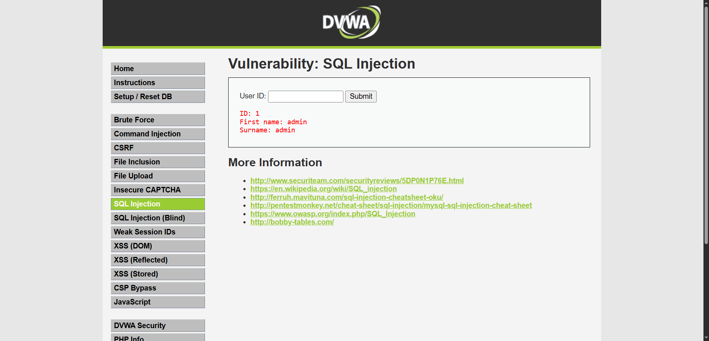
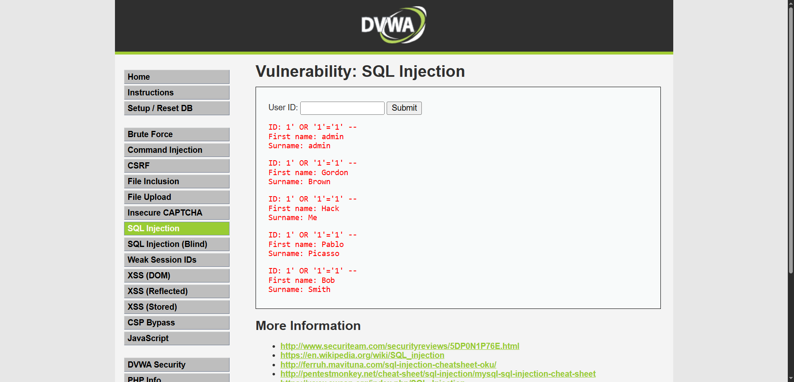
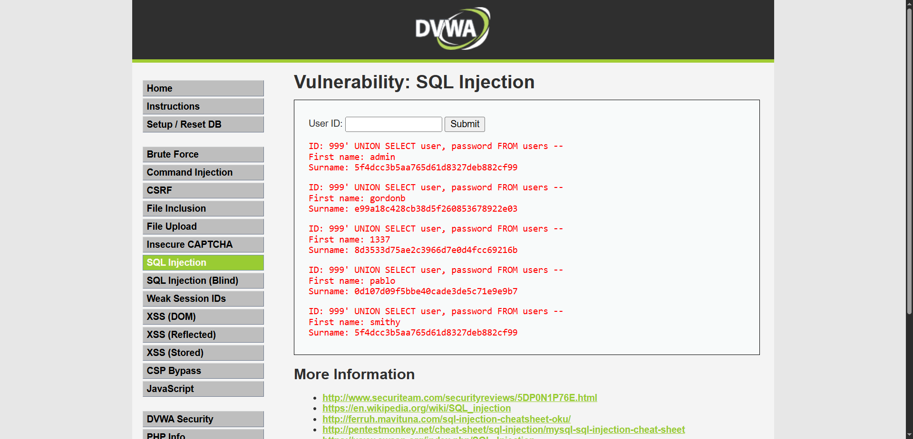

# SQL Injection — DVWA (Low Security)

## Target
DVWA's SQL Injection module, running locally via Docker (`vulnerables/web-dvwa`), security level set to **Low**.

## Objective
Demonstrate progressively more serious SQL injection techniques against a vulnerable "User ID" lookup field — from a basic logic bypass up to full data exfiltration — and explain why each payload works at the query level.

Background on the underlying SQL concepts (SELECT, WHERE, LIKE, UNION mechanics) is documented separately in [`sql-fundamentals.md`](./sql-fundamentals.md).

---

## Baseline — confirming normal behavior

**Payload:** `1`



**Result:**
```
ID: 1
First name: admin
Surname: admin
```

The app is clearly running a query shaped like:
```sql
SELECT first_name, last_name FROM users WHERE user_id = '1';
```
One valid ID in, one matching row out. This confirms the field takes raw input and reflects a single database record — the starting point for everything below.

---

## Payload 1 — Logic-based bypass

**Payload:** `1' OR '1'='1 `


**Result:** returned all 5 users (admin, Gordon Brown, Hack Me, Pablo Picasso, Bob Smith) instead of just one.

**Why it worked:** the app concatenates my input directly into the query without sanitizing the quote character, turning it into:
```sql
SELECT first_name, last_name FROM users WHERE user_id = '1' OR '1'='1';
```
`'1'='1'` is always true, so the `OR` makes the entire `WHERE` clause true for every row — the database returns the whole table instead of filtering by ID at all. This is the simplest form of SQLi: not extracting new data, just breaking the filter logic.

---

## Payload 2 — Comment-terminated bypass

**Payload:** `1' OR '1'='1' -- `

**Result:** same output as Payload 1 — all 5 users returned.



**Why it's different from Payload 1:** functionally identical result here, but the `--` (SQL comment marker) tells the database to ignore everything after it in the original query. This matters in real-world cases where the app's query has extra syntax *after* the injection point (e.g. `... WHERE user_id = 'INPUT' AND active = 1`) — without the comment, that trailing SQL could break the payload or block the bypass. Using `--` is standard practice to make an injection resilient regardless of what comes after the injection point in the original query.

---

## Payload 3 — UNION-based data exfiltration

**Payload:** `999' UNION SELECT user, password FROM users -- `

**Result:**

```
ID: 999' UNION SELECT user, password FROM users --
First name: admin      Surname: 5f4dcc3b5aa765d61d8327deb882cf99
First name: gordonb    Surname: e99a18c428cb38d5f260853678922e03
First name: 1337       Surname: 8d3533d75ae2c3966d7e0d4fcc69216b
First name: pablo      Surname: 0d107d09f5bbe40cade3de5c71e9e9b7
First name: smithy     Surname: 5f4dcc3b5aa765d61d8327deb882cf99
```

**Why it worked:** `UNION SELECT` appends a second, entirely separate query onto the first, merging its results into the same output. Using `999` as the ID ensures the *original* query returns nothing (no user has that ID), so only the injected `UNION` results show up cleanly. The two-column shape (`user, password`) matches the two columns the page already displays (first name, surname), which is required for `UNION` to work — the column counts and rough types must line up.

**Impact:** this is a real escalation from "bypass a login filter" to "dump the entire user table," including password hashes (visible here as MD5 — e.g. `5f4dcc3b5aa765d61d8327deb882cf99`, a widely known weak/crackable hash format). In a real environment, an attacker would take these hashes offline and crack them with a tool like Hashcat or John the Ripper.

---

## Summary

| Payload | Technique | Result |
|---|---|---|
| `1' OR '1'='1` | Logic bypass | Returns all rows instead of one |
| `1' OR '1'='1' --` | Logic bypass + comment termination | Same effect, more resilient to trailing query syntax |
| `999' UNION SELECT user, password FROM users --` | UNION-based exfiltration | Dumps full username + password hash table |

## Root cause

The application builds SQL queries by directly concatenating user input into the query string, with no parameterization (prepared statements) and no input sanitization. Every payload above works because the database can't distinguish "data the user typed" from "SQL syntax the developer wrote."

## Remediation (what a real fix looks like)

- Use **parameterized queries / prepared statements** — user input gets passed as a bound parameter, never concatenated into the SQL string, so it's structurally impossible for it to be interpreted as SQL syntax.
- Apply least-privilege database accounts — the web app's DB user shouldn't have read access to a `password` column it doesn't need for this query.
- Never store passwords as unsalted MD5 — use a slow, salted hash like bcrypt or Argon2.

## Detection angle (Blue Team framing)

From a SOC perspective, all three payloads above share a fingerprint that log monitoring should catch: literal SQL keywords (`OR`, `UNION`, `SELECT`, `--`) and stray single-quote characters inside a field that should only ever contain a numeric ID. A basic detection rule flagging `UNION`, `SELECT`, `' OR `, or `--` inside URL parameters/form fields would have caught all three attempts here. This is the exact pattern the accompanying detection script (`../detection/detect.py`) is built to flag.
