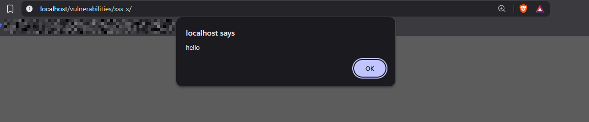
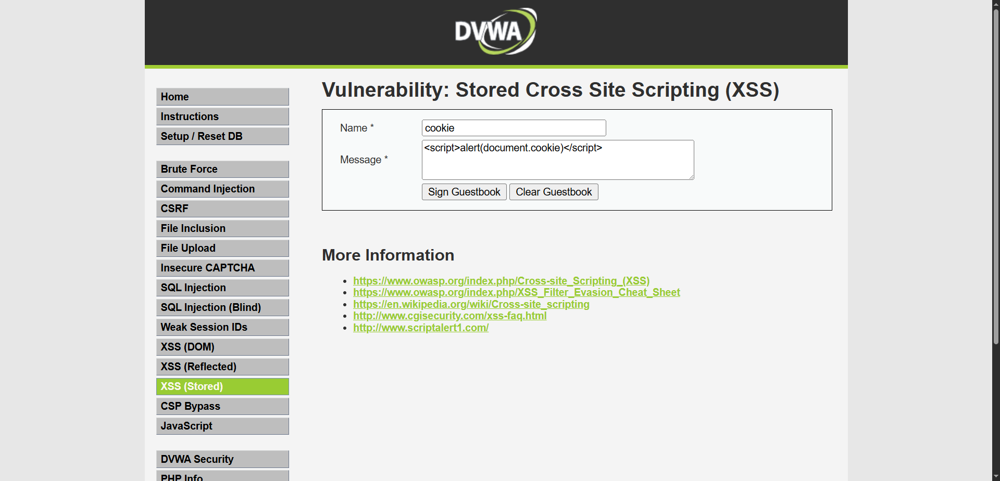
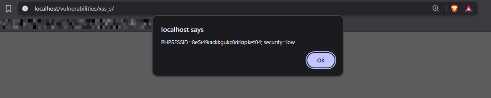
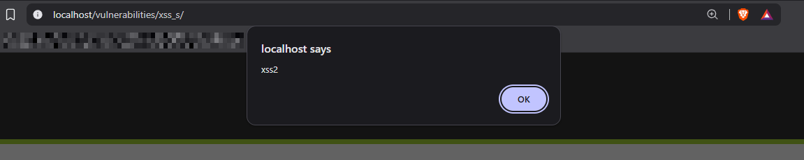
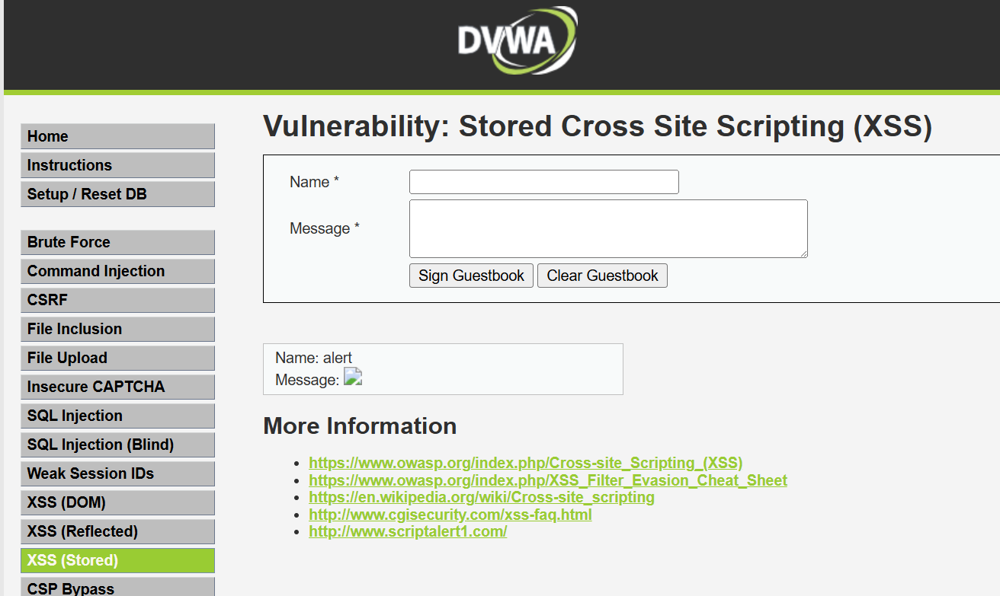

# Stored Cross-Site Scripting (XSS) — DVWA (Low Security)

## Target
DVWA's Stored XSS module (`/vulnerabilities/xss_s/`), running locally via Docker, security level set to **Low**. This page is a guestbook — Name and Message fields get saved and displayed back to anyone who loads the page.

## Objective
Show that unsanitized input isn't just displayed as text — it gets executed as code by the browser. Three variants below build from a basic proof-of-concept up to a real session-hijacking-relevant payload.

---

## Payload 1 — Basic proof of concept

**Input:**
- Name: `hello`
- Message: ``

**Result:** submitting the form immediately triggered a popup box reading "hello."

**Why it worked:** the guestbook saves the Message field and re-renders it directly into the page's HTML with no encoding or filtering. The browser doesn't know the difference between "text the site wants me to display" and "a script tag the site wants me to run" — it just parses whatever HTML it's given. Because DVWA echoes the raw input back into the page, my ``

**Result:** popup displayed the live session cookie: `PHPSESSID=8e5i49iackkgukc0drkipket04; security=low`

**Why this matters more than Payload 1:** `document.cookie` is a real browser API that exposes the current page's cookies to any script running on it — including mine. In this proof-of-concept, the payload just pops the cookie in an alert box. In a real attack, the payload would instead silently send that cookie to an attacker-controlled server (e.g. ``), which the attacker could then use to impersonate the victim's logged-in session without ever knowing their password. This is the mechanism behind real-world session hijacking via XSS.

---

## Payload 3 — Non-script-tag vector (filter evasion concept)

**Input:**
- Name: `alert`
- Message: ``

**Result:** popup displayed "xss2," confirming the payload executed without using a `` | `` | `<script>` tag + cookie API | Exposes live session cookie — real hijacking vector |
| `` | Event-handler attribute, no `<script>` tag | Proves XSS isn't limited to `<script>` tags |

## Root cause

The application stores user input and renders it back into the page's HTML without output encoding (e.g. converting `<` to `&lt;`) or a sanitization library. Any HTML/JS submitted becomes part of the page's actual code for every visitor.

## Remediation (what a real fix looks like)

- **Output encode** all user-supplied data before rendering it into HTML (`<`, `>`, `"`, `'`, `&` converted to their HTML entities) so it's always displayed as text, never parsed as markup.
- Apply a **Content Security Policy (CSP)** header restricting which scripts are allowed to execute on the page, as defense-in-depth even if an encoding gap slips through.
- Use `HttpOnly` on session cookies, so `document.cookie` can't read them from JavaScript at all — this alone would have neutralized Payload 2 even if the XSS itself wasn't fixed.

## Detection angle (Blue Team framing)

From a SOC perspective, all three payloads share a fingerprint worth flagging in input logs: literal `<script>`, `onerror=`, `onload=`, or other HTML event-handler attributes appearing inside a field that should only ever contain plain text (a name or message). A detection rule flagging `<script`, `onerror=`, `onload=`, or `javascript:` in submitted form data would have caught all three attempts here — the same log-flagging approach used for the SQLi detection script in this repo.
